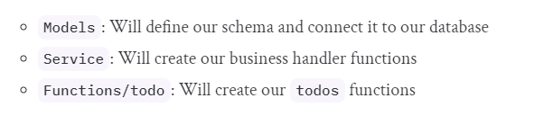

# Finease

Finease is a fintech app that allows users to manage their personal finances.

## Structure

`src` contains the source code for the app.




> [!NOTE] 
> `functions/todo` is just an example (It is not in the project).

I've shared the folder structure of this project below. This is the ```src``` directory.

```
├───functions
│   │   handler.ts
│   │   index.ts
│   │   
│   ├───asset
│   │       handler.ts
│   │       index.ts
│   │       
│   ├───budget
│   │       handler.ts
│   │       index.ts
│   │       
│   ├───investment
│   │       handler.ts
│   │       index.ts
│   │       
│   ├───loan
│   │       handler.ts
│   │       index.ts
│   │       
│   └───profile
│           handler.ts
│           index.ts
│
├───libs
│       api-gateway.ts
│       check-auth.ts
│       handler-resolver.ts
│       lambda.ts
│       
├───models
│       Asset.ts
│       Auth.ts
│       BaseObject.ts
│       Budget.ts
│       BudgetEntry.ts
│       FinancialDetails.ts
│       Income.ts
│       index.ts
│       Insurance.ts
│       Investment.ts
│       Loans.ts
│       Profile.ts
│       User.ts
│
└───services
        index.ts
        service.ts
```

Explanation of the folder structure -
- Inside `functions` are the main serverless functions that would be deployed to AWS Lambda and will run when invoked by API Gateway.
- `libs` are the library functions that are reused across the application.
- `models` are the database models; this is how the data would be stored in the database (DynamoDB).
- Finally, `services` has functions that would connect with the AWS and do operations, like CRUD operations on DynamoDB.


----
Boiler plate - https://github.com/andrenbrandao/serverless-typescript-boilerplate
